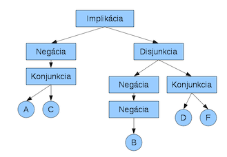

Cvičenie 3
==========

**Riešenie odovzdávajte podľa
[pokynov na konci tohoto zadania](#technické-detaily-riešenia)
do utorka 14.3. 23:59:59.**

Všetky ukážkové a testovacie súbory k tomuto cvičeniu si môžete stiahnuť
ako jeden zip súbor
[cv03.zip](https://github.com/FMFI-UK-1-AIN-412/lpi/archive/cv03.zip).

## Formula (2b)

Vytvorte objektovú hierarchiu na reprezentáciu výrokovologických formúl.
Zadefinujte základnú triedu `Formula` a 6 od nej odvodených tried určených
na reprezentáciu jednotlivých druhov atomických a zložených formúl.

Všetky triedy naprogramujte ako knižnicu podľa
[pokynov na konci tohoto zadania](#technické-detaily-riešenia).

```
Formula
 │    constructor()
 │    Array of Formula subf()     // vrati vsetky priame podformuly ako pole
 │    String toString()             // vrati retazcovu reprezentaciu formuly
 │    Bool isSatisfied(Valuation v) // vrati true, ak je formula splnena
 │                                  // ohodnotenim v
 │
 ├─ Variable
 │      constructor(String name)
 │      String name()   // vrati meno premennej
 │
 ├─ Negation
 │      constructor(Formula originalFormula)
 │      Formula originalFormula()   // vrati povodnu formulu
 │                                  // (jedinu priamu podformulu)
 │
 ├─ Disjunction
 │       constructor(Array of Formula disjuncts)
 │
 ├─ Conjunction
 │       constructor(Array of Formula conjuncts)
 │
 └─ BinaryFormula
      │   constructor(Formula leftSide, Formula rightSide)
      │   Formula leftSide()    // vrati lavu priamu podformulu
      │   Formula rightSide()   // vrati pravu priamu podformulu
      │
      ├─ Implication
      │
      └─ Equivalence
```
Samozrejme použite syntax a základné typy jazyka, ktorý používate (viď
príklady použitia knižnice na konci).

Metódy `toString` a `isSatisfied` budú virtuálne metódy. Predefinujte ich v každej
podtriede tak, aby robili *správnu vec*<sup>TM</sup> pre dotyčný typ formuly.

Metóda `toString` vráti reťazcovú reprezentáciu formuly podľa nasledovných
pravidiel:
- `Variable`: reťazec `a`, kde `a` je meno premennej (môže byť
  viacpísmenkové)
- `Negation`: reťazec `-A`, kde `A` je reprezentácia podformuly
- `Conjunction`:  reťazec `(A&B&C....)`, kde `A`, `B`, `C`, ... sú
  reprezentácie podformúl (konjunktov)
- `Disjunction`:  reťazec `(A|B|C....)`, kde `A`, `B`, `C`, ... sú
  reprezentácie podformúl (disjunktov)
- `Implication`:  reťazec `(A->B)`, kde `A` a `B` sú reprezentácie
  ľavej a pravej podformuly
- `Equivalence`: reťazec `(A<->B)`, kde `A` a `B` sú reprezentácie
  ľavej a pravej podformuly

Teda napríklad v objektovej štruktúre



metóda `toString` koreňového objektu triedy `Implication` vráti reťazec
`(-(A&C)->(--B|(D&F)))`.

Metóda `isSatisfied` vráti `True` alebo `False` podľa toho, či je formula splnená
daným ohodnotením. Ak sa stane, že ohodnotenie neobsahuje nejakú
premennú, ktorá sa vyskytne vo formule, tak môžete buď vygenerovať chybu /
výnimku alebo ju považovať za `False`.

**Bonus.** Ako [bonus 1](../bonus01) môžete naprogramovať parsovanie
reťazcovej reprezentácie formúl, teda metódu, ktorá z daného reťazca
vybuduje štruktúru formulových objektov, ktorú reťazec reprezentuje.

## Ohodnotenie
Ohodnotenie (angl. <i>valuation</i>) je mapa z reťazcov (mien premenných)
do `Bool`. Použite správny typ podľa vášho jazyka:

### C++
Vaša knižnica by mala definovať nasledovný `typedef`:
```c++
typedef std::map<std::string, bool> Valuation;
```
Príklad použitia:
```c++
Valuation v;
v["a"] = true;
Formula *f = new Variable("a");
if (f->isSatisfied(v) != v["a"]) { /* nieco je zle */ }
```

### Python
Slovník (`dict`, `{ … }`), v ktorom sú reťazce mapované na `True` alebo
`False`:
```python
v = { 'a':True, 'b':False }
f = Variable('a')
if f.isSatisfied(v) != v['a']:
	# nieco je zle
```

### Java
Použite implementácie rozhrania `java.util.Map`, napr. `java.util.HashMap`
na reprezentovanie ohodnotenia.

Príklad použitia:
```java
Map<String,Boolean> v = new HashMap<String,Boolean>();
v.put(a,true);
Formula f = new Variable("a");
if (f.isSatisfied(v) != v.get("a")) { /* nieco je zle */ }
```

## Technické detaily riešenia

Riešenie [odovzdajte](../docs/odovzdavanie.md) do vetvy `cv03` v adresári
`cv03`. Odovzdávajte súbor `Formula.h`/`Formula.cpp`, `formula.py`, alebo
`Formula.java`.

Odovzdávanie riešení v iných jazykoch konzultujte s cvičiacimi.

Správne vytvorený pull request sa objaví
v [zozname PR pre `cv03`](https://github.com/pulls?utf8=%E2%9C%93&q=is%3Aopen+is%3Apr+user%3AFMFI-UK-1-AIN-412+base%3Acv03).

### C++
Odovzdajte súbory `Formula.h` a `Formula.cpp`.
Testovací program [`formulaTest.cpp`](formulaTest.cpp) musí ísť skompilovať
s vaším riešením príkazom `g++ -Wall --std=c++11 -o formulaTest *.cpp`
a korektne zbehnúť.

*Poznámka:* Formula vždy vlastní svoje podformuly. Príkaz `delete f`
v programe zmaže zároveň aj všetky podformuly.

### Python
Odovzdajte súbor `formula.py`.
Program [`formulaTest.py`](formulaTest.py) musí korektne zbehnúť s vašou knižnicou.

### Java
Odovzdajte súbor `Formula.java`.
Testovací program [`FormulaTest.java`](FormulaTest.java) musí byť skompilovateľný
a korektne zbehnúť, keď sa k nemu priloží vaša knižnica.
